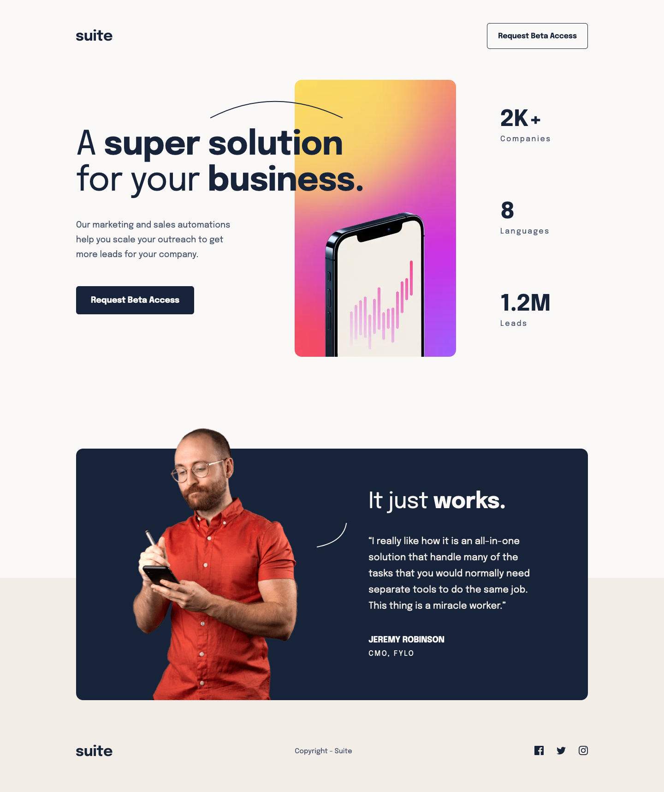

# Suite landing page solution

This is a solution to the [Suite landing page challenge on Frontend Mentor](https://www.frontendmentor.io/challenges/suite-landing-page-tj_eaU-Ra). Frontend Mentor challenges help you improve your coding skills by building realistic projects.

This project showcases a modern and responsive landing page, constructed using HTML for structure and CSS/Sass for styling.

| **Links** | [Live Demo URL](https://ionstici.github.io/suite-landing-page) | [Frontend Mentor](https://www.frontendmentor.io/solutions/suite-landing-page-15sR0tY-Z1) |
| --------- | -------------------------------------------------------------- | ---------------------------------------------------------------------------------------- |

Open Preview Image

 

 

## Tech Stack

-   **HTML5:** For the semantic structure of the landing page.
-   **CSS3 with Sass:** For enhanced styling capabilities, making the management of styles more efficient with variables, mixins, and nesting.

## Acknowledgements

[**Frontend Mentor**](http://frontendmentor.io) helps you improve your frontend coding skills by allowing you to choose from a variety of real-world projects to practice on and guiding you along the way.
